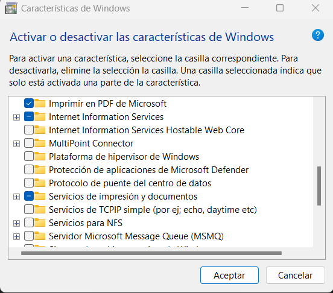
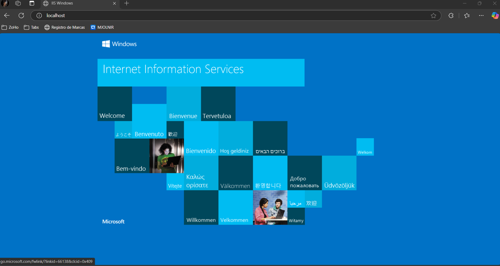
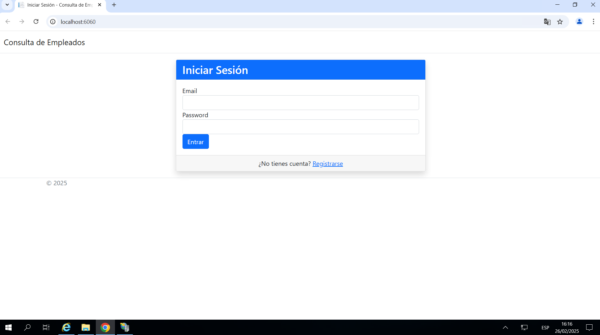
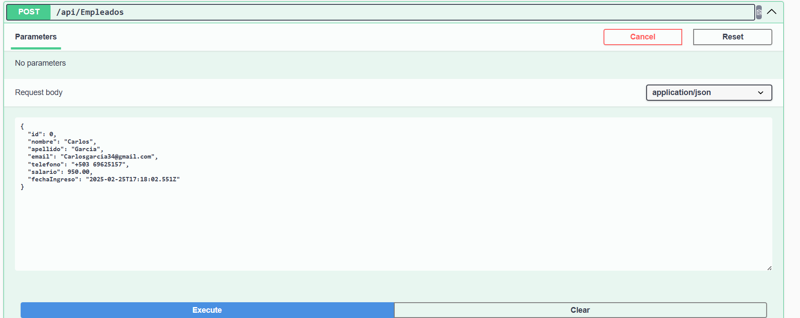
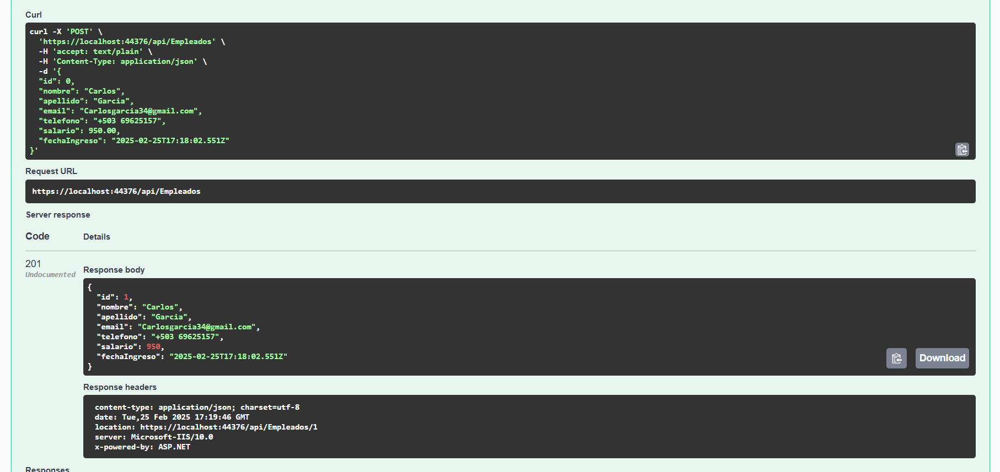

# Examen Práctico - Backend y Frontend

## Configuracion e instalacion de IIS 

En este apartado vamos a explicar como instalar y configurar IIS en windows para desplegar la aplicacion 

### Requisitos Previos

○ Windows 10/11 o Windows Server con IIS disponible.
○ .NET 6+ Hosting Bundle o .NET 8+ Hosting Bundle (según la versión de tu proyecto).
○ Visual Studio 2022 (o superior) instalado.

Cabe aclarar que este proyecto se desarollo en ASP.NET Core 8.0

## instalacion de IIS

1. Presiona la tecla Windows y busca “Activar o desactivar las características de Windows”.
2. Marca la casilla Internet Information Services y haz clic en Aceptar.

3. Espera a que finalice la instalación.
4. Para verificar, abre un navegador y accede a http://localhost/. Si aparece la página de inicio de IIS, significa que la instalación fue exitosa.

## Configuracion de sitio en IIS

1. Presiona la tecla Windows y busca IIS o Administrador de Internet Information Services.
2. Ábrelo para ver el panel de administración.

## Crear un nuevo sitio web

1. En el panel izquierdo, haz clic derecho en Sites y selecciona Add Website... (Agregar sitio...).

2. Se abrirá una ventana para configurar tu sitio:

Nombre del sitio: Por ejemplo, “ExamenPractico”.
Ruta fisica: La ruta donde publicaste tu aplicación, por ejemplo:
C:\Publish\ExamenPracticoMVC\
Port: 80 (o 8080, o el que quieras).
Host name: Opcional, si deseas usar un dominio local, como examen.local.
Haz clic en OK.

Nota: Si deseas usar HTTPS, debes configurar un certificado. Por simplicidad, en este ejemplo usas HTTP.

## Iniciar el sitio y probar

1. En IIS, selecciona el nuevo sitio y haz clic en Start (Iniciar) en el panel de la derecha (Actions).
2. Abre tu navegador y escribe la dirección configurada, por ejemplo:
    http://localhost:80/
    http://localhost/ExamenPracticoMVC/ (dependerá de tu configuración).
3. Deberías ver tu aplicación MVC funcionando.

De esta forma quedaria publicado nuestro proyecto, cualqueir duda o comentario estoy a la orden!

## Ejemplo de solicitud POST en Swagger

Aquí se muestra cómo crear un nuevo empleado desde Swagger:

Resultado de solicitud POST

